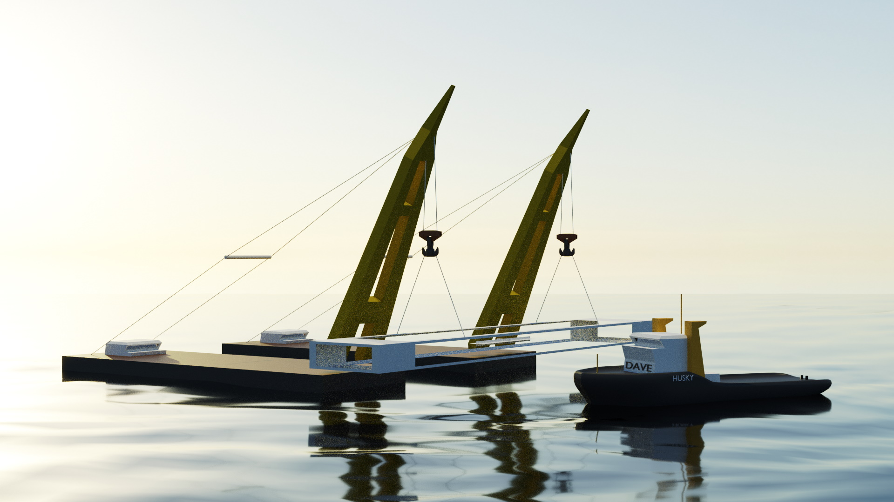

.. image:: docs/images/promo1.jpg

============
DAVE
============

DAVE is a software package designed to make engineering more fun. DAVE will take care of calculations and book-keeping so that you can focus on designing the best solution.

See https://open-ocean.org/dave
Documentation: https://davedocs.online

Download the compiled GUI
==========================

A compiled version of the graphical user interface can be downloaded here: https://www.open-ocean.org/dave-gui-standalone-portable/

Description
===========

DAVE is a python package for bookkeeping and visualization of floating, suspended and/or mechanical systems. It provides a general coordinates based geometry module and a graphical user interface.

Assets are the main building blocks of a model. Assets are digital versions of physical objects and contain all information required to use the item in engineering.
Assets can be imported into a scene (a model). In a scene assets can be connected to eachother and external influences like wind and water can be added.

Various solvers can then be used to investigate how a model behaves.
Static equilibrium can be calculated via the EquilibriumCore plugin. This core supports buoyancy based on linear hydrostatics or an imported shape.
The static equilibrium conditions allows for stability checks, static load distributions in lifting ropes, internal loads, static clearance checks and much more.

Exporting to other software packages is possible. By default an export routine to Blender (3d visualization and animation) is included.
The design of DAVE is such that export to software such as dynamic simulation packages, simulation software or game engines can easily be added.

TUTORIAL
=========

A first video tutorial is available at: https://youtu.be/f-dQaaepsrk

.. raw:: html

   <iframe width="560" height="315" src="https://www.youtube.com/embed/f-dQaaepsrk" frameborder="0" allow="accelerometer; autoplay; encrypted-media; gyroscope; picture-in-picture" allowfullscreen></iframe>

Installation
============

Quick instuctions:

    conda install -c conda-forge DAVE

or (in its own environment)

    conda create -n DAVE DAVE -c conda-forge

To run the Gui:

    python -m DAVE.run_gui

elaborate instructions:

https://www.open-ocean.org/dave-installation/

enjoy!

Future developments
===================

https://www.open-ocean.org/roadmap/

References and credits
======================

DAVE hates re-inventing the wheel. Therefore DAVE uses the following already available software:

- Python, QT, numpy, scipy, matplotlib
- Blender <http://www.blender.org>
- vtkplotter <https://github.com/marcomusy/vtkplotter>
- vtk <http://www.vtk.org>

Note
====

This project relies on EquilibriumCore for geometry and force calculations. This compiled module is downloaded when starting the gui for the first time.
